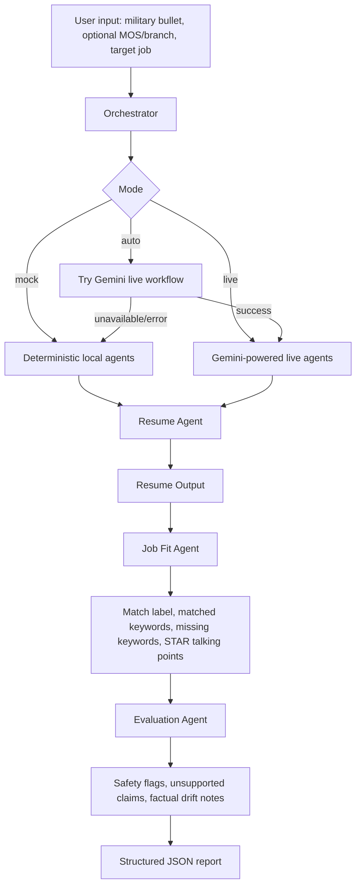

# VetPivot Career Agent

VetPivot Career Agent helps transitioning service members and veterans translate military experience into civilian resume language, evaluate job fit against a target role, and identify gaps or safety risks before applying.

## Problem

Military experience is often difficult to communicate in civilian hiring language. Veterans may have leadership, operations, logistics, maintenance, training, safety, and accountability experience, but their resume bullets can rely on military terms that do not map cleanly to job descriptions or applicant tracking systems.

This creates several risks:

- Valuable experience may be undersold or misunderstood.
- Resume bullets may miss important civilian keywords.
- Job fit may be overstated or understated.
- Generated career advice may invent credentials, metrics, degrees, certifications, or experience.

## Track: Agents for Good

VetPivot fits the Kaggle / Google AI Agents Capstone track **Agents for Good** because it supports veterans during the military-to-civilian career transition. The project focuses on practical career support while adding evaluation and safety checks to avoid misleading resume claims.

## What VetPivot Career Agent Does

Given a military experience bullet, optional MOS/branch context, and a target civilian job description, the CLI demo returns:

- Professional civilian resume bullet
- ATS-aligned resume bullet
- Match label: `Strong Match`, `Partial Match`, or `Weak Match`
- Match analysis
- Matched and missing keywords
- Interview talking points
- Evaluation and safety notes

## Architecture



The project keeps the runnable demo intentionally small: a Python CLI, deterministic sample inputs, mock outputs, tests, and optional Google ADK-facing agent definitions.

## Agent Roles

Resume Agent:

- Translates military experience into civilian resume language.
- Produces a professional bullet and ATS-aligned bullet.
- In `mock` mode, uses deterministic local output.
- In `live` mode, asks Gemini for strict JSON output.
- In `auto` mode, uses Gemini when available and falls back to mock output when unavailable.

Job Fit Agent:

- Compares translated experience against the target job description.
- Uses simple labels only: `Strong Match`, `Partial Match`, `Weak Match`.
- Identifies matched and missing keywords.
- Suggests interview talking points grounded in the provided experience.

Evaluation Agent:

- Reviews the generated resume and job-fit output.
- Flags unsupported claims, risky wording, and factual drift.
- Checks important fact categories such as dollar amounts, team size, years of experience, credentials, degrees, and selected job titles.

## Gemini Live Mode

Live mode uses the Gemini API through the optional `google-genai` dependency. Do not commit API keys.

Install live dependencies:

```bash
pip install -e ".[live]"
```

Configure credentials:

```bash
export GEMINI_API_KEY="your-api-key"
# or
export GOOGLE_API_KEY="your-api-key"
```

Configure the model:

```bash
export VETPIVOT_GEMINI_MODEL="gemini-3.5-flash"
```

`VETPIVOT_GEMINI_MODEL` defaults to `gemini-3.5-flash`, which is listed as a stable Gemini API model in the current Google AI for Developers model documentation. Override it if your API project uses a different supported model.

Mode behavior:

- `--mode mock` is deterministic and offline.
- `--mode live` uses Gemini only and fails clearly if credentials, dependencies, the API call, or JSON parsing fail.
- `--mode auto` tries Gemini first and falls back to mock output if Gemini is unavailable.

Run live CLI mode:

```bash
PYTHONPATH=src python3 -m vetpivot.main --mode live --input examples/strong_match.json
```

Run auto fallback mode:

```bash
PYTHONPATH=src python3 -m vetpivot.main --mode auto --input examples/strong_match.json
```

Check live readiness without making live calls:

```bash
PYTHONPATH=src python3 -m vetpivot.live_smoke --readiness-only
```

Run Gemini/API/ADK live smoke checks after credentials are configured:

```bash
PYTHONPATH=src python3 -m vetpivot.live_smoke
```

The live smoke command prints whether the relevant environment variables are set, but it does not print secret values. Exit code `2` means live credentials are missing, not that the code path failed.

The older VetPivot backend translation helper remains in `src/vetpivot/tools/vetpivot_translate_tool.py` for tool-use evidence and backend-specific tests, but the primary live workflow now runs the three Career Agent roles through Gemini.

## Google ADK Alignment

The project includes Google ADK-facing structure while preserving a reliable local CLI:

- `src/vetpivot/agent.py` exposes `root_agent`, matching ADK project expectations.
- `src/vetpivot/adk_agents.py` defines the root agent and specialized sub-agents.
- The Resume Agent registers the VetPivot translation function as an ADK tool.
- The local live workflow uses Gemini-powered Resume, Job Fit, and Evaluation Agent behavior.
- The local CLI remains deterministic in mock mode for reproducible evaluation.
- Tests cover tool behavior, fallback behavior, and evaluation checks.

Google ADK live execution remains optional because the capstone evidence package prioritizes reproducible local judging.

## Evaluation and Safety Approach

Evaluation focuses on both final output quality and agent/tool behavior:

- Unit tests verify mock mode, Gemini live behavior with mocked responses, strict live failure, auto fallback, backend helper behavior, invalid backend response fallback, and ADK entrypoint import.
- Safety tests verify unsupported credential detection.
- Factual drift checks flag changed or omitted dollar amounts, team size, years of experience, credentials, degrees, and selected job titles.
- `EVALS.md` records the rubric, test cases, and manual review checklist.
- Demo outputs are saved under `examples/outputs/` for judge inspection.

## Demo Cases

Three deterministic mock demo cases are included:

| Case | Input | Saved Output | Purpose |
|---|---|---|---|
| Strong match | `examples/strong_match.json` | `examples/outputs/strong_match_output.json` | Shows close alignment with an operations coordinator role |
| Partial match | `examples/partial_match.json` | `examples/outputs/partial_match_output.json` | Shows some transferable coordination experience with gaps |
| Safety risk / overclaim | `examples/safety_risk_overclaim.json` | `examples/outputs/safety_risk_overclaim_output.json` | Shows a senior role with degree/certification/experience requirements that should not be invented |

## How To Run Mock Demo

Run one sample:

```bash
PYTHONPATH=src python3 -m vetpivot.main --mode mock --input examples/strong_match.json
```

Run all three samples:

```bash
PYTHONPATH=src python3 -m vetpivot.main --mode mock --input examples/strong_match.json
PYTHONPATH=src python3 -m vetpivot.main --mode mock --input examples/partial_match.json
PYTHONPATH=src python3 -m vetpivot.main --mode mock --input examples/safety_risk_overclaim.json
```

## How To Run Tests

```bash
PYTHONPATH=src python3 -m pytest -p no:cacheprovider
```

## Known Limitations

- Mock mode is deterministic and useful for judging, but it is not a full LLM resume writer.
- Backend translation may be unavailable in local Python environments if SSL trust is not configured.
- Google ADK live execution is structured but not required for the offline evidence package.
- The project does not include a MOS database or job taxonomy.
- Fit labels are simple and non-numeric by design.
- The tool does not store user data.
- The project does not include frontend, database, authentication, dashboard, job tracking, job board integration, long-term memory, or upload parsing.

## API Bridge

Mission 4 adds a small FastAPI bridge so an existing frontend can eventually call the Career Agent workflow without changing the CLI.

Start the local API server:

```bash
PYTHONPATH=src uvicorn vetpivot.api:app --host 127.0.0.1 --port 8000
```

Open interactive API docs:

```text
http://127.0.0.1:8000/docs
```

Endpoint:

```text
POST /api/career-agent
```

Frontend compatibility endpoint:

```text
POST /api/translate
```

Health check:

```text
GET /health
```

Example request:

```bash
curl -sS -X POST http://127.0.0.1:8000/api/career-agent \
  -H "Content-Type: application/json" \
  -d '{
    "military_experience": "Led a team of 12 soldiers maintaining communications equipment valued at $2.3M.",
    "mos_branch": "Army communications team leader",
    "target_job_description": "Operations coordinator responsible for team coordination, equipment inventory, safety compliance, and communication."
  }'
```

Response fields:

- `professional_resume_bullet`
- `ats_optimized_bullet`
- `job_fit_assessment`
- `matched_keywords`
- `missing_keywords`
- `interview_talking_points`
- `evaluation_notes`
- `safety_flags`
- `unsupported_claims`
- `mode`

The API defaults to deterministic `mock` mode. It also accepts `mode: "live"` and `mode: "auto"` without changing the response shape used by the frontend.

The compatibility endpoint accepts the older simple frontend request shape:

```bash
curl -sS -X POST http://127.0.0.1:8000/api/translate \
  -H "Content-Type: application/json" \
  -d '{
    "text": "Led a team of 12 soldiers maintaining communications equipment valued at $2.3M.",
    "mode": "mock"
  }'
```

It returns:

```json
{
  "translation": "Translated resume bullet...",
  "mode": "mock"
}
```

## Cloud Run Deployment Prep

The recommended production path is to deploy this API as a separate Cloud Run service named `vetpivot-career-agent`. Do not point the live Firebase site at this service until the direct Cloud Run smoke test passes.

Required environment variables:

```bash
PYTHONPATH=src
GEMINI_API_KEY=...
VETPIVOT_GEMINI_MODEL=gemini-3.5-flash
```

Optional compatibility variables:

```bash
GOOGLE_API_KEY=...
GOOGLE_APPLICATION_CREDENTIALS=...
VETPIVOT_TRANSLATE_URL=https://vetpivot-backend-796137818435.us-central1.run.app/api/translate
VETPIVOT_TRANSLATE_TIMEOUT_SECONDS=8
```

Deploy command, for approved deployment only:

```bash
gcloud run deploy vetpivot-career-agent \
  --source . \
  --region us-central1 \
  --project vet-resume-builder \
  --allow-unauthenticated \
  --set-env-vars PYTHONPATH=src,VETPIVOT_GEMINI_MODEL=gemini-3.5-flash
```

Smoke test the service directly before changing Firebase Hosting or frontend configuration:

```bash
CAREER_AGENT_URL="https://YOUR-CLOUD-RUN-URL"

curl -sS "$CAREER_AGENT_URL/health"

curl -sS -X POST "$CAREER_AGENT_URL/api/career-agent" \
  -H "Content-Type: application/json" \
  -d '{
    "military_experience": "Led a team of 12 soldiers maintaining communications equipment valued at $2.3M.",
    "mos_branch": "Army communications team leader",
    "target_job_description": "Operations coordinator responsible for team coordination, equipment inventory, safety compliance, and communication.",
    "mode": "mock"
  }'
```

Rollback notes:

```bash
gcloud run revisions list \
  --service vetpivot-career-agent \
  --region us-central1 \
  --project vet-resume-builder

gcloud run services update-traffic vetpivot-career-agent \
  --region us-central1 \
  --project vet-resume-builder \
  --to-revisions PREVIOUS_REVISION=100
```

If the direct Cloud Run smoke test fails, do not update Firebase Hosting rewrites or frontend environment variables.

## Kaggle Notebook Walkthrough

A judge-facing offline walkthrough is available at:

```text
notebooks/vetpivot_career_agent_demo.ipynb
```

The notebook explains the problem, Agents for Good track, architecture, agent roles, tool usage, Google ADK alignment, safety/evaluation approach, and known limitations. It runs the strong match, partial match, and safety-risk demo cases in deterministic `mock` mode without live credentials.
